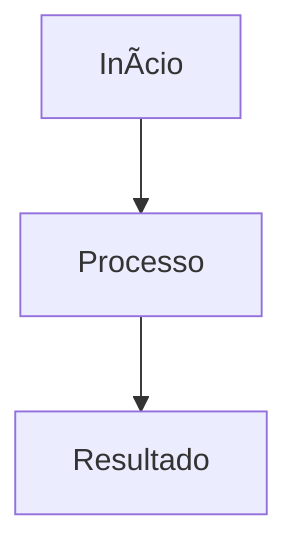

# 🎯 Script para Aplicar Padrão em Todos os READMEs

## 📋 Instruções de Uso

Este documento contém o processo para aplicar o padrão de README em todos os arquivos da pasta `Docs/FUNCOES/`.

### 🎯 Padrão Estabelecido

**Estrutura Obrigatória:**
1. **Visão Geral** - Objetivo e localização dos arquivos
2. **Problema Resolvido** - Antes vs Depois
3. **Arquitetura da Solução** - Componentes e fluxo
4. **Implementação Técnica** - Código completo das funções
5. **Estrutura do Banco** - Tabelas e relacionamentos
6. **Como Usar** - Exemplos práticos
7. **Debug e Logs** - Logs implementados
8. **Troubleshooting** - 5 erros comuns com soluções
9. **Comandos de Debug** - SQL e JavaScript
10. **Resultado Final** - Antes vs Depois
11. **Manutenção** - Monitoramento e melhorias
12. **Notas Importantes** - Pontos críticos
13. **Resumo para Correção** - Sequência de ações

### 📁 READMEs para Aplicar Padrão

**PRIORIDADE ALTA:**
- [x] `attachment-visual-field-fallback.md` ✅ CONCLUÍDO
- [x] `attachments-system.md` ✅ CONCLUÍDO  
- [x] `comments-system.md` ✅ CONCLUÍDO
- [ ] `tasks-system.md` - Sistema de tarefas
- [ ] `soft-delete-kanban-cards.md` - Soft delete de cards

**PRIORIDADE MÉDIA:**
- [ ] `attachment-delete-features.md` - Exclusão de anexos
- [ ] `attachment-system-flow.md` - Fluxo de anexos
- [ ] `attachments-modal-setup.md` - Setup do modal
- [ ] `comments-migration-setup.md` - Migração de comentários
- [ ] `ingressar-function.md` - Função ingressar

**PRIORIDADE BAIXA:**
- [ ] `SETUP_CONVERSAS_CORRELACIONADAS.md` - Conversas correlacionadas
- [ ] `SETUP_DRAG_AND_DROP.md` - Drag and drop
- [ ] `SETUP_TASKS_SYSTEM.md` - Setup de tarefas

### 🔧 Processo de Aplicação

**Para cada README:**

1. **Ler arquivo atual** e identificar funcionalidade
2. **Identificar arquivos** relacionados no código
3. **Extrair código** das funções principais
4. **Identificar problemas** comuns e soluções
5. **Aplicar estrutura** do padrão
6. **Adicionar troubleshooting** específico
7. **Incluir comandos** de debug
8. **Testar** se está completo

### 📝 Template de Aplicação

```markdown
# [NOME DA FUNCIONALIDADE]

## 📋 Visão Geral
[Descrição clara do que faz]

**🎯 OBJETIVO:** [Objetivo específico]

**📁 LOCALIZAÇÃO DOS ARQUIVOS:**
- `caminho/arquivo1.tsx` - [Descrição]
- `caminho/arquivo2.tsx` - [Descrição]

## 🎯 Problema Resolvido
**Problema Original:**
- [Problema 1]
- [Problema 2]

**Solução Implementada:**
- [Solução 1]
- [Solução 2]

## 🏗️ Arquitetura da Solução
### Componentes Envolvidos
```
src/
├── pasta1/
│   └── arquivo1.tsx
└── pasta2/
    └── arquivo2.tsx
```

### Fluxo de Dados


## 🔧 Implementação Técnica
### 1. [Nome da Função]
**Localização:** `caminho/arquivo.tsx` (linhas X-Y)

**FUNÇÃO COMPLETA:**
```typescript
const funcao = () => {
  // Código completo
};
```

**COMO USAR:**
- [Instrução 1]
- [Instrução 2]

**PROBLEMAS COMUNS:**
- **Erro X**: [Solução]
- **Erro Y**: [Solução]

## 📊 Estrutura do Banco
```sql
CREATE TABLE tabela (
  id uuid PRIMARY KEY,
  campo1 text NOT NULL
);
```

## 🚀 Como Usar
```typescript
// Exemplo de uso
const resultado = await funcao();
```

## 🔍 Debug e Logs
```typescript
console.log('🔍 Debug:', data);
```

## 🚨 Troubleshooting - Erros Comuns
### Erro 1: "[Descrição]"
**Sintomas:**
- [Sintoma 1]
- [Sintoma 2]

**Diagnóstico:**
```javascript
console.log('🔍 Debug:', {...});
```

**Soluções:**
1. [Solução 1]
2. [Solução 2]

## 🛠️ Comandos de Debug
### 1. Verificar no Banco
```sql
SELECT * FROM tabela WHERE condicao;
```

### 2. Verificar Logs
```javascript
console.log('=== DEBUG ===');
```

## ✅ Resultado Final
### Antes
- ❌ [Problema 1]
- ❌ [Problema 2]

### Depois
- ✅ [Solução 1]
- ✅ [Solução 2]

## 🛠️ Manutenção
### Monitoramento
- [Item 1]
- [Item 2]

### Melhorias Futuras
- [Melhoria 1]
- [Melhoria 2]

## 📝 Notas Importantes
1. [Nota 1]
2. [Nota 2]

## 🎯 Resumo para Correção de Erros
**QUANDO HOUVER PROBLEMA:**
1. Identificar erro pelos logs
2. Localizar arquivo usando tabela
3. Verificar função específica
4. Aplicar solução do troubleshooting
5. Testar se funciona

**COMANDO RÁPIDO:**
```bash
console.log('=== DEBUG [FUNCIONALIDADE] ===');
```

**ARQUIVOS PRINCIPAIS:**
- `arquivo1.tsx` - [Descrição]
- `arquivo2.tsx` - [Descrição]

---
**Última atualização:** [Data]
**Versão:** 1.0
**Status:** ✅ Implementado e Funcionando
```

### ✅ Checklist de Aplicação

**Para cada README, verificar:**

- [ ] **Visão Geral** com objetivo e localização
- [ ] **Problema Resolvido** com antes/depois
- [ ] **Arquitetura** com componentes e fluxo
- [ ] **Implementação Técnica** com código completo
- [ ] **Estrutura do Banco** com tabelas
- [ ] **Como Usar** com exemplos
- [ ] **Debug e Logs** com logs implementados
- [ ] **Troubleshooting** com 5 erros comuns
- [ ] **Comandos de Debug** com SQL e JS
- [ ] **Resultado Final** com antes/depois
- [ ] **Manutenção** com monitoramento
- [ ] **Notas Importantes** com pontos críticos
- [ ] **Resumo para Correção** com sequência

### 🎯 Resultado Esperado

**Após aplicar o padrão, cada README deve permitir:**

1. **Identificar rapidamente** o que a funcionalidade faz
2. **Localizar arquivos** relacionados no código
3. **Entender implementação** através do código completo
4. **Debugar problemas** usando logs e comandos
5. **Corrigir erros** seguindo troubleshooting
6. **Manter sistema** com monitoramento

### 📞 Comando de Uso

**Para aplicar em um README específico:**

> "Claude, vá até o README da funcionalidade [NOME], entenda como ela funciona e aplique o padrão estabelecido"

**O Claude vai:**
1. ✅ Ler o README atual
2. ✅ Identificar a funcionalidade
3. ✅ Localizar arquivos no código
4. ✅ Extrair código das funções
5. ✅ Aplicar estrutura do padrão
6. ✅ Adicionar troubleshooting
7. ✅ Incluir comandos de debug
8. ✅ Testar se está completo

---

**Status:** ✅ Padrão Estabelecido  
**Próximo:** Aplicar em `tasks-system.md`
