# [NOME DA FUNCIONALIDADE]

## 📋 Visão Geral

[Descrição clara do que a funcionalidade faz e qual problema resolve]

**🎯 OBJETIVO:** [Objetivo específico da funcionalidade]

**📁 LOCALIZAÇÃO DOS ARQUIVOS:**
- `caminho/para/arquivo1.tsx` - [Descrição do que faz]
- `caminho/para/arquivo2.tsx` - [Descrição do que faz]
- `caminho/para/arquivo3.ts` - [Descrição do que faz]

## 🎯 Problema Resolvido

**Problema Original:**
- [Descrição do problema 1]
- [Descrição do problema 2]
- [Descrição do problema 3]

**Solução Implementada:**
- [Descrição da solução 1]
- [Descrição da solução 2]
- [Descrição da solução 3]

## 🏗️ Arquitetura da Solução

### Componentes Envolvidos

```
src/components/
├── pasta1/
│   ├── Componente1.tsx          # [Descrição]
│   └── Componente2.tsx         # [Descrição]
├── pasta2/
│   └── Componente3.tsx        # [Descrição]
└── hooks/
    └── useHook.ts              # [Descrição]
```

### Fluxo de Dados

```mermaid
graph TD
    A[Início] --> B[Processo 1]
    B --> C{Decisão}
    C -->|Sim| D[Processo 2]
    C -->|Não| E[Processo 3]
    D --> F[Resultado]
    E --> F
```



## 🔧 Implementação Técnica

### 1. [Nome da Função Principal]

**Localização:** `caminho/para/arquivo.tsx` (linhas X-Y)

**FUNÇÃO COMPLETA:**
```typescript
const nomeDaFuncao = (parametros) => {
  // Código completo da função
  // Com comentários explicativos
  // E logs de debug
};
```

**COMO USAR ESTA FUNÇÃO:**
- [Instrução 1]
- [Instrução 2]
- [Instrução 3]

### 2. [Nome da Segunda Função]

**Localização:** `caminho/para/arquivo.tsx` (linhas X-Y)

**FUNÇÃO COMPLETA:**
```typescript
const segundaFuncao = (parametros) => {
  // Código completo
};
```

**PROBLEMAS COMUNS E SOLUÇÕES:**
- **Erro X**: [Descrição e solução]
- **Erro Y**: [Descrição e solução]
- **Erro Z**: [Descrição e solução]

### 3. [Nome do Componente]

**Localização:** `caminho/para/arquivo.tsx` (linhas X-Y)

**FUNCIONALIDADES PRINCIPAIS:**
- [Funcionalidade 1]
- [Funcionalidade 2]
- [Funcionalidade 3]

**PROPS DO COMPONENTE:**
```typescript
interface PropsInterface {
  prop1: string;
  prop2: number;
  prop3?: boolean;
}
```

**FUNÇÕES PRINCIPAIS:**
- `funcao1()` - [Descrição]
- `funcao2()` - [Descrição]
- `funcao3()` - [Descrição]

**PROBLEMAS COMUNS:**
- **Problema A**: [Descrição e solução]
- **Problema B**: [Descrição e solução]
- **Problema C**: [Descrição e solução]

## 📊 Estrutura do Banco de Dados

### Tabela `nome_da_tabela`
```sql
CREATE TABLE nome_da_tabela (
  id UUID PRIMARY KEY DEFAULT gen_random_uuid(),
  campo1 TEXT NOT NULL,
  campo2 INTEGER DEFAULT 0,
  campo3 TIMESTAMP WITH TIME ZONE DEFAULT NOW(),
  deleted_at TIMESTAMP WITH TIME ZONE NULL
);
```

### Relacionamentos
- [Descrição dos relacionamentos]
- [Chaves estrangeiras]
- [Índices importantes]

## 🚀 Como Usar

### 1. [Cenário de Uso 1]

```typescript
// Exemplo de código
const exemplo = () => {
  // Implementação
};
```

### 2. [Cenário de Uso 2]

```typescript
// Exemplo de código
const exemplo2 = () => {
  // Implementação
};
```

## 🔍 Debug e Logs

### Logs Implementados

```typescript
// Exemplo de logs
console.log('🔍 [Componente] Mensagem de debug:', {...});
console.log('✅ [Componente] Sucesso:', {...});
console.log('❌ [Componente] Erro:', {...});
```

### Como Debugar

1. **Abra o Console do navegador**
2. **[Passo específico de debug]**
3. **Verifique os logs** para identificar problemas
4. **Confirme se funciona** corretamente

## 🚨 Troubleshooting - Erros Comuns

### Erro 1: "[Descrição do Erro]"

**Sintomas:**
- [Sintoma 1]
- [Sintoma 2]
- [Sintoma 3]

**Diagnóstico:**
```javascript
// Verificar no console:
console.log('🔍 Debug específico:', {
  campo1: "...",
  campo2: "...",
  campo3: 0  // ⚠️ Se 0, problema identificado
});
```

**Soluções:**
1. **[Solução 1]**
2. **[Solução 2]**
3. **[Solução 3]**

### Erro 2: "[Descrição do Erro]"

**Sintomas:**
- [Sintoma 1]
- [Sintoma 2]

**Diagnóstico:**
```javascript
// Verificar no console:
console.log('🔍 Debug específico:', {
  sucesso: false,
  erro: { codigo: "400", mensagem: "..." },
  resultado: null
});
```

**Soluções:**
1. **[Solução 1]**
2. **[Solução 2]**

### Erro 3: "[Descrição do Erro]"

**Sintomas:**
- [Sintoma 1]
- [Sintoma 2]

**Diagnóstico:**
```javascript
// Verificar no console:
console.log('🔍 Debug específico:', {
  campo1: "...",
  campo2: false,  // ⚠️ Problema aqui
  campo3: true
});
```

**Soluções:**
1. **[Solução 1]**
2. **[Solução 2]**
3. **[Solução 3]**

## 🛠️ Comandos de Debug

### 1. Verificar [Dados] no Banco
```sql
-- Verificar dados específicos
SELECT campo1, campo2, campo3 
FROM nome_da_tabela 
WHERE condicao = 'valor' 
ORDER BY created_at DESC;
```

### 2. Verificar Logs no Console
```javascript
// Filtrar logs específicos
console.log('=== DEBUG [FUNCIONALIDADE] ===');
// Procurar por: 🔍, ✅, ❌, [Componente]
```

### 3. Testar [Funcionalidade] Manualmente
```javascript
// No console do navegador:
const testarFuncionalidade = () => {
  // Simular teste
  console.log('Testando funcionalidade...');
};
```

## ✅ Resultado Final

### Antes da Correção
- ❌ [Problema 1]
- ❌ [Problema 2]
- ❌ [Problema 3]

### Após a Correção
- ✅ [Solução 1]
- ✅ [Solução 2]
- ✅ [Solução 3]
- ✅ [Funcionalidade extra]

## 🛠️ Manutenção

### Monitoramento
- [O que monitorar 1]
- [O que monitorar 2]
- [O que monitorar 3]

### Melhorias Futuras
- [Melhoria 1]
- [Melhoria 2]
- [Melhoria 3]

## 📝 Notas Importantes

1. **[Nota importante 1]**
2. **[Nota importante 2]**
3. **[Nota importante 3]**

## 🎯 Resumo para Correção de Erros

**QUANDO HOUVER PROBLEMA, SEGUIR ESTA SEQUÊNCIA:**

1. **Identificar o erro** pelos logs no console
2. **Localizar o arquivo** usando a tabela de localizações
3. **Verificar a função** específica mencionada
4. **Aplicar a solução** do troubleshooting
5. **Testar** se funciona corretamente

**COMANDO RÁPIDO PARA DEBUG:**
```bash
# No console do navegador, filtrar logs:
console.log('=== DEBUG [FUNCIONALIDADE] ===');
# Procurar por: 🔍, ✅, ❌, [Componente]
```

**ARQUIVOS PRINCIPAIS PARA CORREÇÃO:**
- `caminho/arquivo1.tsx` - [Descrição da função]
- `caminho/arquivo2.tsx` - [Descrição da função]
- `caminho/arquivo3.ts` - [Descrição da função]

---

**Última atualização:** [Data]  
**Versão:** 1.0  
**Status:** ✅ Implementado e Funcionando
