# Sistema de Campo Visual para Anexos em Conversas Encadeadas

## 📋 Visão Geral

Este documento descreve o sistema de fallback implementado para exibir anexos como campos visuais (com CTAs de pré-visualização e download) nas conversas encadeadas, mesmo quando os anexos não estão corretamente vinculados a comentários específicos.

**🎯 OBJETIVO:** Garantir que anexos sempre apareçam como campos visuais interativos nas conversas encadeadas, mesmo quando há falhas na vinculação com comentários.

**📁 LOCALIZAÇÃO DOS ARQUIVOS:**
- `src/components/comments/CommentsList.tsx` - Lógica principal de busca
- `src/components/comments/CommentContentRenderer.tsx` - Renderização de conteúdo
- `src/components/comments/AttachmentCard.tsx` - Campo visual do anexo
- `src/components/ui/ModalEditarFicha.tsx` - Upload e criação de comentários
- `src/hooks/useAttachments.ts` - Hook de gerenciamento de anexos

## 🎯 Problema Resolvido

**Problema Original:**
- Anexos eram salvos no backend (Storage) mas não apareciam como campos visuais no frontend
- Anexos apareciam apenas como texto simples nas conversas encadeadas
- Falta de vinculação entre anexos e comentários (`comment_id = NULL`)

**Solução Implementada:**
- Sistema de 4 níveis de fallback para encontrar e exibir anexos
- Campo visual completo com CTAs de pré-visualização e download
- Funcionamento mesmo quando comentários automáticos falham

## 🏗️ Arquitetura da Solução

### Componentes Envolvidos

```
src/components/
├── comments/
│   ├── CommentsList.tsx          # Lógica de busca de anexos
│   ├── CommentContentRenderer.tsx # Renderização de conteúdo
│   └── AttachmentCard.tsx        # Campo visual do anexo
├── ui/
│   └── ModalEditarFicha.tsx      # Upload e criação de comentários
└── attachments/
    └── AttachmentUploadModal.tsx  # Interface de upload
```

### Fluxo de Dados

```mermaid
graph TD
    A[Upload de Anexo] --> B[Salvar no Storage]
    B --> C[Criar Comentário Automático]
    C --> D{Comentário Criado?}
    D -->|Sim| E[Vincular comment_id]
    D -->|Não| F[Fallback: Buscar Anexos]
    E --> G[Exibir AttachmentCard]
    F --> H[4 Níveis de Fallback]
    H --> G
    G --> I[Campo Visual com CTAs]
```



## 🔧 Implementação Técnica

### 1. Função `getAttachmentsForComment()` - 4 Níveis de Fallback

**Localização:** `src/components/comments/CommentsList.tsx` (linhas 97-220)

**FUNÇÃO COMPLETA:**
```typescript
const getAttachmentsForComment = (commentId: string, commentCardId: string, content?: string) => {
  console.log('🔍 getAttachmentsForComment chamada:', {
    commentId,
    commentCardId,
    content: content?.substring(0, 100) + '...',
    totalAttachments: attachments.length
  });

  // NÍVEL 1: Busca por comment_id (anexos vinculados corretamente)
  let commentAttachments = attachments.filter(attachment => 
    attachment.comment_id === commentId
  );
  console.log('🔍 Anexos por comment_id:', commentAttachments.length);

  // NÍVEL 2: Se não encontrar e o comentário mencionar anexo, usar fallback
  const mentionsAttachment = !!content && (
    content.includes('📎') ||
    content.toLowerCase().includes('anexo adicionado:') ||
    content.toLowerCase().includes('arquivo anexado:') ||
    content.toLowerCase().includes('arquivo anexado')
  );

  if (commentAttachments.length === 0 && content && mentionsAttachment) {
    console.log('🔍 Usando fallback para anexos sem comment_id');
    
    // Extrair nome do arquivo do texto do comentário
    const fileNameMatch = (
      content.match(/📎\s*Anexo adicionado:\s*(.+?)(?:\n|$)/) ||
      content.match(/Anexo adicionado:\s*(.+?)(?:\n|$)/i) ||
      content.match(/Arquivo anexado:\s*(.+?)(?:\n|$)/i)
    );
    
    if (fileNameMatch) {
      const fileName = fileNameMatch[1].trim();
      console.log('🔍 Nome do arquivo extraído:', fileName);
      
      // Buscar TODOS os anexos que NÃO têm comment_id (anexos órfãos)
      const attachmentsWithoutComment = attachments.filter(a => !a.comment_id);
      console.log('🔍 Anexos sem comment_id:', attachmentsWithoutComment.length);
      
      // Filtrar por nome de arquivo EXATO
      let candidateAttachments = attachmentsWithoutComment.filter(attachment => 
        attachment.file_name === fileName || 
        attachment.file_name?.toLowerCase() === fileName.toLowerCase()
      );
      
      // Se tem múltiplos matches, filtrar por card_id
      if (candidateAttachments.length > 1) {
        const filteredByCardId = candidateAttachments.filter(attachment => 
          attachment.card_id === commentCardId
        );
        
        if (filteredByCardId.length > 0) {
          candidateAttachments = filteredByCardId;
        }
      }
      
      // Pegar o mais recente se ainda tiver múltiplos
      if (candidateAttachments.length > 0) {
        commentAttachments = [candidateAttachments.sort((a, b) => 
          new Date(b.created_at || 0).getTime() - new Date(a.created_at || 0).getTime()
        )[0]];
      }
    }
  }
  
  // NÍVEL 4: Fallback final - anexos recentes do card (últimos 5 minutos)
  if (commentAttachments.length === 0 && content && mentionsAttachment) {
    console.log('🔍 Fallback final: Mostrando anexos recentes do card');
    
    const recentAttachments = attachments.filter(attachment => {
      const attachmentTime = new Date(attachment.created_at || 0).getTime();
      const now = Date.now();
      const fiveMinutesAgo = now - (5 * 60 * 1000);
      
      return attachment.card_id === commentCardId && 
             attachmentTime > fiveMinutesAgo &&
             !attachment.comment_id;
    });
    
    if (recentAttachments.length > 0) {
      console.log('🔍 Anexos recentes encontrados:', recentAttachments.length);
      commentAttachments = recentAttachments.slice(0, 1); // Pegar apenas o mais recente
    }
  }
  
  console.log('🔍 RESULTADO FINAL:', {
    commentId,
    totalAttachments: attachments.length,
    commentAttachments: commentAttachments.length,
    attachmentDetails: commentAttachments.map(a => ({ 
      id: a.id, 
      file_name: a.file_name, 
      file_path: a.file_path,
      comment_id: a.comment_id
    }))
  });
  
  return commentAttachments;
};
```

**COMO USAR ESTA FUNÇÃO:**
- É chamada automaticamente pelo `CommentContentRenderer`
- Recebe: `commentId`, `commentCardId`, `content` do comentário
- Retorna: Array de anexos encontrados
- Logs detalhados para debug

### 2. Criação de Comentário Automático Melhorada

**Localização:** `src/components/ui/ModalEditarFicha.tsx` (linhas 134-175)

**FUNÇÃO COMPLETA:**
```typescript
// Após upload bem-sucedido do anexo
console.log('📎 [ModalEditarFicha] Nenhum comentário automático encontrado. Criando comentário manualmente...');
const content = `📎 Anexo adicionado: ${uploaded.file_name}`;

console.log('📎 [ModalEditarFicha] Dados do comentário:', {
  card_id: card.id,
  author_id: profile.id,
  author_name: currentUserName || profile.full_name || 'Usuário',
  author_role: profile.role,
  content,
  level: 0
});

const { data: manualComment, error: ccErr } = await (supabase as any)
  .from('card_comments')
  .insert({
    card_id: card.id,
    author_id: profile.id,
    author_name: currentUserName || profile.full_name || 'Usuário',
    author_role: profile.role,
    content,
    level: 0,
    thread_id: `thread_${card.id}_${Date.now()}`,  // ✅ Campo obrigatório
    is_thread_starter: true                       // ✅ Campo obrigatório
  })
  .select('id')
  .single();
  
console.log('📎 [ModalEditarFicha] Resultado da criação do comentário:', {
  success: !ccErr,
  error: ccErr,
  commentId: manualComment?.id
});

if (!ccErr && manualComment?.id) {
  try {
    await (supabase as any)
      .from('card_attachments')
      .update({ comment_id: manualComment.id })
      .eq('id', uploaded.id);
  } catch {}
}
```

**PROBLEMAS COMUNS E SOLUÇÕES:**
- **Erro 400**: Campos `thread_id` e `is_thread_starter` são obrigatórios
- **Erro de permissão**: Verificar se `profile.id` e `profile.role` estão definidos
- **Falha na vinculação**: Verificar se `uploaded.id` existe e é válido

### 3. Componente AttachmentCard

**Localização:** `src/components/comments/AttachmentCard.tsx` (linhas 81-417)

**FUNCIONALIDADES PRINCIPAIS:**
- **Lado esquerdo**: Botão de pré-visualização (👁️) com ícone do tipo de arquivo
- **Lado direito**: Botão de download (⬇️)
- **Menu de 3 pontos**: Opção de excluir
- **Modal de preview**: Para PDFs e outros tipos de arquivo
- **Permissões**: Controle de acesso baseado em roles

**PROPS DO COMPONENTE:**
```typescript
interface AttachmentCardProps {
  attachment: {
    id: string;
    file_name: string;
    file_path: string;
    file_size: number;
    file_type: string;
    file_extension: string;
    author_name: string;
    author_id?: string;
    description?: string;
    created_at?: string;
  };
  onDownload: (filePath: string, fileName: string) => void;
  onPreview?: (filePath: string, fileName: string) => void;
  onDelete?: (attachmentId: string, filePath: string) => void;
}
```

**FUNÇÕES PRINCIPAIS:**
- `handlePreview()` - Abre modal de pré-visualização
- `handleDownload()` - Inicia download do arquivo
- `handleDeleteClick()` - Abre dialog de confirmação de exclusão
- `getPdfUrl()` - Busca URL do PDF para preview

**PROBLEMAS COMUNS:**
- **Preview não funciona**: Verificar se `file_path` está correto
- **Download falha**: Verificar permissões do usuário
- **Exclusão não funciona**: Verificar se `onDelete` está sendo passado

## 📊 Estrutura do Banco de Dados

### Tabela `card_attachments`
```sql
CREATE TABLE card_attachments (
  id UUID PRIMARY KEY DEFAULT gen_random_uuid(),
  card_id UUID NOT NULL,
  comment_id UUID NULL,  -- ⚠️ Campo crítico para vinculação
  author_id UUID NOT NULL,
  author_name TEXT NOT NULL,
  file_name TEXT NOT NULL,
  file_path TEXT NOT NULL,
  file_size BIGINT NOT NULL,
  file_type TEXT NOT NULL,
  file_extension TEXT NOT NULL,
  description TEXT NULL,
  created_at TIMESTAMP WITH TIME ZONE DEFAULT NOW(),
  deleted_at TIMESTAMP WITH TIME ZONE NULL
);
```

### Tabela `card_comments`
```sql
CREATE TABLE card_comments (
  id UUID PRIMARY KEY DEFAULT gen_random_uuid(),
  card_id UUID NOT NULL,
  author_id UUID NOT NULL,
  author_name TEXT NOT NULL,
  content TEXT NOT NULL,
  level INTEGER DEFAULT 0,
  thread_id TEXT NOT NULL,           -- ✅ Campo obrigatório
  is_thread_starter BOOLEAN DEFAULT TRUE,  -- ✅ Campo obrigatório
  created_at TIMESTAMP WITH TIME ZONE DEFAULT NOW(),
  deleted_at TIMESTAMP WITH TIME ZONE NULL
);
```

## 🚀 Como Usar

### 1. Upload de Anexo via CTA "Anexo"

```typescript
// O sistema automaticamente:
// 1. Faz upload para Storage
// 2. Cria registro em card_attachments
// 3. Tenta criar comentário automático
// 4. Se falhar, usa fallback para exibir anexo
```

### 2. Exibição em Conversas Encadeadas

```typescript
// O sistema busca anexos usando 4 níveis de fallback:
// 1. Por comment_id (vinculação direta)
// 2. Por nome de arquivo + card_id
// 3. Por anexos órfãos do card
// 4. Por anexos recentes (últimos 5 minutos)
```

## 🔍 Debug e Logs

### Logs Implementados

```typescript
// Upload de anexo
console.log('📎 [ModalEditarFicha] Iniciando upload de anexo...');
console.log('📎 [ModalEditarFicha] Dados do comentário:', {...});
console.log('📎 [ModalEditarFicha] Resultado da criação do comentário:', {...});

// Busca de anexos
console.log('🔍 getAttachmentsForComment chamada:', {...});
console.log('🔍 Anexos por comment_id:', count);
console.log('🔍 Usando fallback para anexos sem comment_id');
console.log('🔍 Fallback final: Mostrando anexos recentes do card');
console.log('🔍 RESULTADO FINAL:', {...});

// Renderização
console.log('🔍 CommentContentRenderer DEBUG:', {...});
```

### Como Debugar

1. **Abra o Console do navegador**
2. **Anexe um arquivo** via CTA "Anexo"
3. **Verifique os logs** para identificar em qual nível o fallback está funcionando
4. **Confirme se o AttachmentCard aparece** nas conversas encadeadas

## 🚨 Troubleshooting - Erros Comuns

### Erro 1: "Anexos não aparecem nas conversas"

**Sintomas:**
- Upload funciona, notificação aparece
- Anexos não aparecem como campos visuais
- Console mostra: `🔍 Anexos por comment_id: 0`

**Diagnóstico:**
```javascript
// Verificar no console:
console.log('🔍 getAttachmentsForComment chamada:', {
  commentId: "...",
  commentCardId: "...",
  content: "...",
  totalAttachments: 0  // ⚠️ Se 0, problema no hook useAttachments
});
```

**Soluções:**
1. **Verificar se `useAttachments` está carregando anexos**
2. **Verificar se `cardId` está correto**
3. **Verificar se comentário menciona anexo** (`content.includes('📎')`)

### Erro 2: "Erro 400 ao criar comentário"

**Sintomas:**
- Console mostra: `Failed to load resource: the server responded with a status of 400`
- Comentário não é criado
- Anexo fica órfão

**Diagnóstico:**
```javascript
// Verificar no console:
console.log('📎 [ModalEditarFicha] Resultado da criação do comentário:', {
  success: false,
  error: { code: "400", message: "..." },
  commentId: null
});
```

**Soluções:**
1. **Verificar campos obrigatórios**: `thread_id` e `is_thread_starter`
2. **Verificar permissões**: `profile.id` e `profile.role` definidos
3. **Verificar estrutura da tabela**: `card_comments` tem todos os campos

### Erro 3: "AttachmentCard não renderiza"

**Sintomas:**
- Anexos são encontrados mas não aparecem visualmente
- Console mostra: `🔍 CommentContentRenderer DEBUG: { hasAttachmentsFromDB: false }`

**Diagnóstico:**
```javascript
// Verificar no console:
console.log('🔍 CommentContentRenderer DEBUG:', {
  content: "...",
  hasAttachmentsFromDB: false,  // ⚠️ Problema aqui
  isAttachmentComment: true,
  attachmentCount: 0
});
```

**Soluções:**
1. **Verificar se `getAttachmentsForComment` retorna anexos**
2. **Verificar se `CommentContentRenderer` recebe attachments**
3. **Verificar se `AttachmentCard` está sendo renderizado**

### Erro 4: "Download não funciona"

**Sintomas:**
- AttachmentCard aparece mas download falha
- Console mostra: `Failed to get download URL for: ...`

**Diagnóstico:**
```javascript
// Verificar no console:
console.log('attachment.file_path:', attachment.file_path);
console.log('attachment.file_name:', attachment.file_name);
```

**Soluções:**
1. **Verificar se `file_path` está correto**
2. **Verificar permissões do usuário**
3. **Verificar se arquivo existe no Storage**

### Erro 5: "Preview não funciona"

**Sintomas:**
- Botão de preview não abre modal
- Console mostra: `Error getting PDF URL for preview`

**Diagnóstico:**
```javascript
// Verificar no console:
console.log('Getting PDF URL for preview:', filePath);
console.log('PDF URL found for preview:', url);
```

**Soluções:**
1. **Verificar se `getPdfUrl()` está funcionando**
2. **Verificar se arquivo é PDF**
3. **Verificar permissões de acesso**

## 🛠️ Comandos de Debug

### 1. Verificar Anexos no Banco
```sql
-- Verificar anexos do card
SELECT id, file_name, file_path, comment_id, created_at 
FROM card_attachments 
WHERE card_id = 'SEU_CARD_ID' 
ORDER BY created_at DESC;

-- Verificar comentários do card
SELECT id, content, created_at 
FROM card_comments 
WHERE card_id = 'SEU_CARD_ID' 
ORDER BY created_at DESC;
```

### 2. Verificar Logs no Console
```javascript
// Filtrar logs de anexos
console.log('=== DEBUG ANEXOS ===');
// Procurar por: 🔍, 📎, AttachmentCard
```

### 3. Testar Fallback Manualmente
```javascript
// No console do navegador:
const testFallback = () => {
  // Simular busca de anexos
  console.log('Testando fallback...');
};
```

## ✅ Resultado Final

### Antes da Correção
- ❌ Anexos apareciam apenas como texto simples
- ❌ Sem CTAs de pré-visualização ou download
- ❌ Falha na vinculação com comentários

### Após a Correção
- ✅ Campo visual completo com AttachmentCard
- ✅ CTAs de pré-visualização (👁️) e download (⬇️)
- ✅ 4 níveis de fallback garantem exibição
- ✅ Funciona mesmo quando comentários automáticos falham
- ✅ Logs detalhados para debug

## 🛠️ Manutenção

### Monitoramento
- Verificar logs de erro 400 na criação de comentários
- Acompanhar taxa de sucesso dos fallbacks
- Validar se anexos estão sendo exibidos corretamente

### Melhorias Futuras
- Implementar trigger automático no banco de dados
- Adicionar cache para anexos recentes
- Melhorar performance dos fallbacks
- Implementar retry automático para criação de comentários

## 📝 Notas Importantes

1. **Campos Obrigatórios**: `thread_id` e `is_thread_starter` são obrigatórios na tabela `card_comments`
2. **Fallback Temporal**: Anexos são considerados "recentes" se criados nos últimos 5 minutos
3. **Permissões**: O sistema respeita as permissões de download e exclusão baseadas em roles
4. **Performance**: O fallback é executado apenas quando necessário (anexos não encontrados por `comment_id`)

## 🎯 Resumo para Correção de Erros

**QUANDO HOUVER PROBLEMA, SEGUIR ESTA SEQUÊNCIA:**

1. **Identificar o erro** pelos logs no console
2. **Localizar o arquivo** usando a tabela de localizações
3. **Verificar a função** específica mencionada
4. **Aplicar a solução** do troubleshooting
5. **Testar** se o AttachmentCard aparece

**COMANDO RÁPIDO PARA DEBUG:**
```bash
# No console do navegador, filtrar logs:
console.log('=== DEBUG ANEXOS ===');
# Procurar por: 🔍, 📎, AttachmentCard
```

**ARQUIVOS PRINCIPAIS PARA CORREÇÃO:**
- `src/components/comments/CommentsList.tsx` - Função `getAttachmentsForComment()`
- `src/components/ui/ModalEditarFicha.tsx` - Criação de comentários
- `src/components/comments/AttachmentCard.tsx` - Renderização visual
- `src/hooks/useAttachments.ts` - Carregamento de anexos

---

**Última atualização:** Dezembro 2024  
**Versão:** 1.0  
**Status:** ✅ Implementado e Funcionando
