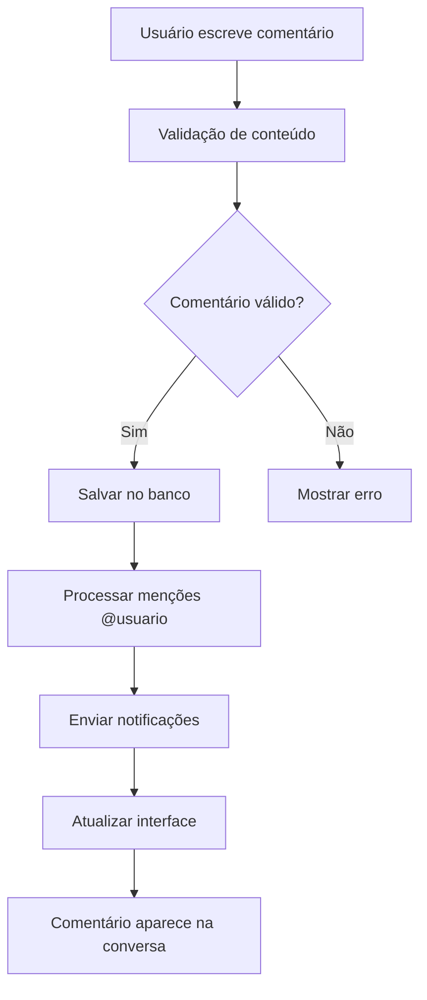

# Sistema de Comentários - Conversas Encadeadas e Hierarquia

## 📋 Visão Geral

Sistema completo de comentários que permite comunicação hierárquica e contextual dentro das fichas do Kanban. Suporta conversas encadeadas, anexos, tarefas e menções (@usuario) com notificações automáticas.

**🎯 OBJETIVO:** Permitir comunicação estruturada e hierárquica entre usuários nas fichas do Kanban com suporte a anexos, tarefas e notificações.

**📁 LOCALIZAÇÃO DOS ARQUIVOS:**
- `src/hooks/useComments.ts` - Hook principal de gerenciamento
- `src/components/comments/CommentsList.tsx` - Lista principal de comentários
- `src/components/comments/CommentItem.tsx` - Item individual de comentário
- `src/components/comments/CommentContentRenderer.tsx` - Renderização de conteúdo
- `src/components/ui/ObservationsWithComments.tsx` - Integração com observações

## 🎯 Problema Resolvido

**Problema Original:**
- Falta de comunicação estruturada nas fichas
- Sem suporte a conversas encadeadas
- Dificuldade para acompanhar discussões
- Sem notificações automáticas

**Solução Implementada:**
- Sistema hierárquico de comentários
- Conversas encadeadas com thread_id
- Integração com anexos e tarefas
- Notificações automáticas por menções
- Soft delete para auditoria

## 🏗️ Arquitetura da Solução

### Componentes Envolvidos

```
src/
├── hooks/
│   └── useComments.ts                    # Hook principal
├── components/
│   ├── comments/
│   │   ├── CommentsList.tsx             # Lista principal
│   │   ├── CommentItem.tsx              # Item individual
│   │   ├── CommentContentRenderer.tsx  # Renderização
│   │   └── AttachmentCard.tsx           # Card de anexo
│   └── ui/
│       └── ObservationsWithComments.tsx # Integração
```

### Fluxo de Dados



## 🔧 Implementação Técnica

### 1. Hook `useComments` - Gerenciamento Principal

**Localização:** `src/hooks/useComments.ts` (linhas 1-400)

**FUNÇÃO COMPLETA:**
```typescript
export const useComments = (cardId: string) => {
  const [comments, setComments] = useState<Comment[]>([]);
  const [isLoading, setIsLoading] = useState(false);
  const [isSubmitting, setIsSubmitting] = useState(false);
  const { profile } = useAuth();

  // Carregar comentários do card
  const loadComments = async () => {
    if (!cardId) return;
    
    setIsLoading(true);
    try {
      const { data, error } = await supabase
        .from('card_comments')
        .select('*')
        .eq('card_id', cardId)
        .is('deleted_at', null)
        .order('created_at', { ascending: true });

      if (error) throw error;
      setComments(data || []);
    } catch (error) {
      console.error('Error loading comments:', error);
    } finally {
      setIsLoading(false);
    }
  };

  // Criar novo comentário
  const createComment = async (data: CreateCommentData) => {
    if (!cardId) throw new Error('Card ID required');
    if (!data.content?.trim()) throw new Error('Conteúdo obrigatório');
    
    setIsSubmitting(true);
    try {
      // Processar menções @usuario
      const processedContent = processMentions(data.content);
      
      // Gerar thread_id se não existir
      const threadId = data.threadId || `thread_${cardId}_${Date.now()}`;
      
      const { data: newComment, error } = await supabase
        .from('card_comments')
        .insert({
          card_id: cardId,
          author_id: data.authorId,
          author_name: data.authorName,
          author_role: data.authorRole,
          content: processedContent,
          parent_id: data.parentId,
          level: data.level,
          thread_id: threadId,
          is_thread_starter: !data.parentId
        })
        .select()
        .single();
      
      if (error) throw error;
      
      // Enviar notificações para menções
      await sendMentionNotifications(processedContent, cardId);
      
      // Recarregar comentários
      await loadComments();
      return newComment;
    } catch (error) {
      console.error('Error creating comment:', error);
      throw error;
    } finally {
      setIsSubmitting(false);
    }
  };

  // Atualizar comentário
  const updateComment = async (commentId: string, content: string) => {
    try {
      const { error } = await supabase
        .from('card_comments')
        .update({ 
          content: content,
          updated_at: new Date().toISOString()
        })
        .eq('id', commentId);
      
      if (error) throw error;
      await loadComments();
      return true;
    } catch (error) {
      console.error('Error updating comment:', error);
      return false;
    }
  };

  // Deletar comentário (soft delete)
  const deleteComment = async (commentId: string) => {
    try {
      // Primeiro, deletar todas as respostas (comentários filhos)
      const childComments = comments.filter(c => c.parent_id === commentId);
      for (const child of childComments) {
        await deleteComment(child.id);
      }

      // Depois, deletar o comentário principal
      const { error } = await supabase
        .from('card_comments')
        .update({
          deleted_at: new Date().toISOString(),
          deleted_by: profile.id
        })
        .eq('id', commentId);
      
      if (error) throw error;
      
      setComments(prev => prev.filter(comment => comment.id !== commentId));
      return true;
    } catch (error) {
      console.error('Error deleting comment:', error);
      return false;
    }
  };

  // Processar menções @usuario
  const processMentions = (content: string) => {
    const mentionRegex = /@(\w+)/g;
    return content.replace(mentionRegex, (match, username) => {
      return `@${username}`;
    });
  };

  // Enviar notificações para menções
  const sendMentionNotifications = async (content: string, cardId: string) => {
    const mentionRegex = /@(\w+)/g;
    const mentions = content.match(mentionRegex);
    
    if (mentions) {
      for (const mention of mentions) {
        const username = mention.replace('@', '');
        // Implementar lógica de notificação
        console.log(`Notificando usuário: ${username}`);
      }
    }
  };

  return {
    comments,
    isLoading,
    isSubmitting,
    loadComments,
    createComment,
    updateComment,
    deleteComment
  };
};
```

**COMO USAR ESTE HOOK:**
- Recebe `cardId` como parâmetro
- Retorna estado e funções para gerenciar comentários
- Carrega automaticamente comentários do card
- Inclui processamento de menções e notificações

### 2. Lista de Comentários

**Localização:** `src/components/comments/CommentsList.tsx` (linhas 1-300)

**FUNÇÃO COMPLETA:**
```typescript
export function CommentsList({ cardId, onRefetch }) {
  const { 
    comments, 
    isLoading, 
    createComment, 
    deleteComment,
    loadComments 
  } = useComments(cardId);
  
  const [newComment, setNewComment] = useState('');
  const [replyingTo, setReplyingTo] = useState<string | null>(null);
  const [showDeleteDialog, setShowDeleteDialog] = useState(false);
  const [deletingComment, setDeletingComment] = useState<Comment | null>(null);

  // Organizar comentários em árvore hierárquica
  const organizeComments = (comments: Comment[]): Comment[] => {
    interface CommentWithReplies extends Comment {
      replies: CommentWithReplies[];
    }

    const commentMap = new Map<string, CommentWithReplies>();
    const rootComments: CommentWithReplies[] = [];

    // Criar mapa de comentários
    comments.forEach(comment => {
      commentMap.set(comment.id, { ...comment, replies: [] });
    });

    // Organizar hierarquia
    comments.forEach(comment => {
      const commentWithReplies = commentMap.get(comment.id)!;
      
      if (comment.parent_id) {
        const parent = commentMap.get(comment.parent_id);
        if (parent) {
          parent.replies.push(commentWithReplies);
        }
      } else {
        rootComments.push(commentWithReplies);
      }
    });

    return rootComments;
  };

  // Enviar comentário
  const handleSubmit = async (e: React.FormEvent) => {
    e.preventDefault();
    if (!newComment.trim()) return;

    try {
      await createComment({
        cardId,
        authorId: profile.id,
        authorName: profile.full_name,
        authorRole: profile.role,
        content: newComment,
        parentId: replyingTo,
        level: replyingTo ? 1 : 0,
        threadId: replyingTo ? comments.find(c => c.id === replyingTo)?.thread_id : undefined
      });
      
      setNewComment('');
      setReplyingTo(null);
    } catch (error) {
      console.error('Error creating comment:', error);
    }
  };

  // Excluir comentário
  const handleDelete = async (comment: Comment) => {
    setDeletingComment(comment);
    setShowDeleteDialog(true);
  };

  const handleDeleteConfirm = async () => {
    if (deletingComment) {
      try {
        await deleteComment(deletingComment.id);
        setShowDeleteDialog(false);
        setDeletingComment(null);
      } catch (error) {
        console.error('Error deleting comment:', error);
      }
    }
  };

  // Renderizar comentário
  const renderComment = (comment: CommentWithReplies, level: number = 0) => {
    return (
      <div key={comment.id} className={`ml-${level * 4}`}>
        <div className="bg-white border rounded-lg p-4 mb-2">
          <div className="flex items-start justify-between">
            <div className="flex-1">
              <div className="flex items-center gap-2 mb-2">
                <div className="w-8 h-8 bg-blue-500 rounded-full flex items-center justify-center text-white text-sm">
                  {comment.author_name.charAt(0).toUpperCase()}
                </div>
                <div>
                  <div className="font-medium">{comment.author_name}</div>
                  <div className="text-sm text-gray-500">
                    {new Date(comment.created_at).toLocaleString()}
                  </div>
                </div>
              </div>
              
              <div className="text-gray-800 mb-3">
                <CommentContentRenderer content={comment.content} />
              </div>
              
              <div className="flex gap-2">
                <button
                  onClick={() => setReplyingTo(comment.id)}
                  className="text-blue-600 hover:text-blue-800 text-sm"
                >
                  Responder
                </button>
                {comment.author_id === profile.id && (
                  <button
                    onClick={() => handleDelete(comment)}
                    className="text-red-600 hover:text-red-800 text-sm"
                  >
                    Excluir
                  </button>
                )}
              </div>
            </div>
          </div>
        </div>
        
        {/* Renderizar respostas */}
        {comment.replies.map(reply => renderComment(reply, level + 1))}
      </div>
    );
  };

  if (isLoading) {
    return <div className="text-center py-4">Carregando comentários...</div>;
  }

  const organizedComments = organizeComments(comments);

  return (
    <div className="space-y-4">
      {/* Formulário de novo comentário */}
      <form onSubmit={handleSubmit} className="space-y-4">
        <div>
          <textarea
            value={newComment}
            onChange={(e) => setNewComment(e.target.value)}
            placeholder="Escreva um comentário..."
            className="w-full p-3 border rounded-lg resize-none"
            rows={3}
          />
        </div>
        
        <div className="flex justify-end gap-2">
          {replyingTo && (
            <button
              type="button"
              onClick={() => setReplyingTo(null)}
              className="px-4 py-2 text-gray-600 hover:text-gray-800"
            >
              Cancelar
            </button>
          )}
          <button
            type="submit"
            disabled={!newComment.trim() || isSubmitting}
            className="px-4 py-2 bg-blue-600 text-white rounded-lg hover:bg-blue-700 disabled:opacity-50"
          >
            {isSubmitting ? 'Enviando...' : 'Comentar'}
          </button>
        </div>
      </form>

      {/* Lista de comentários */}
      <div className="space-y-4">
        {organizedComments.map(comment => renderComment(comment))}
      </div>

      {/* Dialog de confirmação de exclusão */}
      <Dialog open={showDeleteDialog} onOpenChange={setShowDeleteDialog}>
        <DialogContent>
          <DialogHeader>
            <DialogTitle>Excluir Comentário</DialogTitle>
            <DialogDescription>
              Tem certeza que deseja excluir este comentário? Esta ação não pode ser desfeita.
            </DialogDescription>
          </DialogHeader>
          <DialogFooter>
            <Button variant="outline" onClick={() => setShowDeleteDialog(false)}>
              Cancelar
            </Button>
            <Button variant="destructive" onClick={handleDeleteConfirm}>
              Excluir
            </Button>
          </DialogFooter>
        </DialogContent>
      </Dialog>
    </div>
  );
}
```

**PROBLEMAS COMUNS E SOLUÇÕES:**
- **Comentário não aparece**: Verificar se `cardId` está correto
- **Hierarquia quebrada**: Verificar se `parent_id` está sendo definido
- **Menções não funcionam**: Verificar se `processMentions()` está sendo chamado

### 3. Renderização de Conteúdo

**Localização:** `src/components/comments/CommentContentRenderer.tsx` (linhas 1-200)

**FUNCIONALIDADES PRINCIPAIS:**
- **Texto simples**: Renderização básica de texto
- **Menções**: Destaque para @usuario
- **Anexos**: Integração com AttachmentCard
- **Tarefas**: Renderização de tarefas inline
- **Links**: Conversão automática de URLs

**PROPS DO COMPONENTE:**
```typescript
interface CommentContentRendererProps {
  content: string;
  attachments?: Attachment[];
  onDownloadAttachment?: (filePath: string, fileName: string) => void;
  onDeleteAttachment?: (attachmentId: string) => void;
}
```

**FUNÇÕES PRINCIPAIS:**
- `renderText()` - Renderização de texto com menções
- `renderAttachments()` - Renderização de anexos
- `renderTasks()` - Renderização de tarefas
- `processMentions()` - Processamento de menções

**PROBLEMAS COMUNS:**
- **Menções não destacam**: Verificar se regex está correto
- **Anexos não aparecem**: Verificar se `attachments` está sendo passado
- **Tarefas não renderizam**: Verificar se `renderTasks()` está implementado

## 📊 Estrutura do Banco de Dados

### Tabela `card_comments`
```sql
CREATE TABLE public.card_comments (
  id uuid PRIMARY KEY DEFAULT gen_random_uuid(),
  card_id uuid REFERENCES public.kanban_cards(id) ON DELETE CASCADE,
  parent_id uuid REFERENCES public.card_comments(id) ON DELETE CASCADE,
  author_id uuid REFERENCES public.profiles(id) NOT NULL,
  author_name text NOT NULL,
  author_role text,
  content text NOT NULL,
  level integer DEFAULT 0,
  thread_id text NOT NULL,
  is_thread_starter boolean DEFAULT true,
  created_at timestamptz NOT NULL DEFAULT now(),
  updated_at timestamptz NOT NULL DEFAULT now(),
  deleted_at timestamptz,
  deleted_by uuid REFERENCES public.profiles(id)
);
```

### Índices para Performance
```sql
-- Índice para busca por card
CREATE INDEX idx_card_comments_card_id ON public.card_comments(card_id);

-- Índice para busca por thread
CREATE INDEX idx_card_comments_thread_id ON public.card_comments(thread_id);

-- Índice para busca por autor
CREATE INDEX idx_card_comments_author_id ON public.card_comments(author_id);
```

### RLS Policies
```sql
-- Política de seleção
CREATE POLICY "card_comments_select_all" ON public.card_comments
  FOR SELECT USING (deleted_at IS NULL);

-- Política de inserção
CREATE POLICY "card_comments_insert_authenticated" ON public.card_comments
  FOR INSERT WITH CHECK (auth.role() = 'authenticated');

-- Política de atualização
CREATE POLICY "card_comments_update_author" ON public.card_comments
  FOR UPDATE USING (auth.uid() = author_id);

-- Política de exclusão
CREATE POLICY "card_comments_delete_author_or_manager" ON public.card_comments
  FOR DELETE USING (
    auth.uid() = author_id OR 
    EXISTS (
      SELECT 1 FROM public.profiles 
      WHERE id = auth.uid() AND role = 'gestor'
    )
  );
```

## 🚀 Como Usar

### 1. Criar Comentário

```typescript
const { createComment } = useComments(cardId);

await createComment({
  cardId: 'card-uuid',
  authorId: 'user-uuid',
  authorName: 'João Silva',
  authorRole: 'gestor',
  content: 'Comentário com menção @maria',
  parentId: null, // Para comentário raiz
  level: 0
});
```

### 2. Responder Comentário

```typescript
await createComment({
  cardId: 'card-uuid',
  authorId: 'user-uuid',
  authorName: 'João Silva',
  authorRole: 'gestor',
  content: 'Resposta ao comentário',
  parentId: 'parent-comment-uuid',
  level: 1
});
```

### 3. Excluir Comentário

```typescript
const { deleteComment } = useComments(cardId);

await deleteComment('comment-uuid');
```

## 🔍 Debug e Logs

### Logs Implementados

```typescript
// Criação de comentário
console.log('💬 [useComments] Criando comentário:', data);
console.log('💬 [useComments] Comentário criado:', newComment);

// Processamento de menções
console.log('🔔 [useComments] Processando menções:', content);
console.log('🔔 [useComments] Menções encontradas:', mentions);

// Exclusão
console.log('🗑️ [useComments] Excluindo comentário:', commentId);
console.log('🗑️ [useComments] Comentário excluído');
```

### Como Debugar

1. **Abra o Console do navegador**
2. **Escreva um comentário** com menção @usuario
3. **Verifique os logs** para identificar problemas
4. **Confirme se o comentário aparece** na conversa

## 🚨 Troubleshooting - Erros Comuns

### Erro 1: "Comentário não aparece"

**Sintomas:**
- Comentário não é exibido na lista
- Console mostra: `Comentários carregados: 0`
- Interface não atualiza

**Diagnóstico:**
```javascript
// Verificar no console:
console.log('💬 [useComments] Comentários carregados:', comments.length);
console.log('💬 [useComments] Card ID:', cardId);
```

**Soluções:**
1. **Verificar se `cardId` está correto**
2. **Verificar se tabela `card_comments` existe**
3. **Verificar se RLS policies estão corretas**

### Erro 2: "Menções não funcionam"

**Sintomas:**
- @usuario não é destacado
- Notificações não são enviadas
- Console mostra: `Menções encontradas: []`

**Diagnóstico:**
```javascript
// Verificar no console:
console.log('🔔 [useComments] Processando menções:', content);
console.log('🔔 [useComments] Menções encontradas:', mentions);
```

**Soluções:**
1. **Verificar se regex está correto** em `processMentions()`
2. **Verificar se `sendMentionNotifications()` está implementado**
3. **Verificar se usuários existem** no sistema

### Erro 3: "Hierarquia quebrada"

**Sintomas:**
- Respostas não aparecem aninhadas
- Comentários ficam desorganizados
- Console mostra: `Parent ID: null`

**Diagnóstico:**
```javascript
// Verificar no console:
console.log('💬 [useComments] Organizando comentários:', {
  total: comments.length,
  roots: rootComments.length,
  replies: replies.length
});
```

**Soluções:**
1. **Verificar se `parent_id` está sendo definido**
2. **Verificar se `organizeComments()` está funcionando**
3. **Verificar se `thread_id` está correto**

### Erro 4: "Exclusão não funciona"

**Sintomas:**
- Botão de exclusão não aparece
- Console mostra: `Sem permissão para excluir`
- Usuário não consegue excluir

**Diagnóstico:**
```javascript
// Verificar no console:
console.log('💬 [useComments] Permissões:', {
  canDelete: false,
  authorId: comment.author_id,
  currentUserId: profile.id,
  userRole: profile.role
});
```

**Soluções:**
1. **Verificar se usuário é autor** do comentário
2. **Verificar se usuário é gestor**
3. **Verificar RLS policies** no banco

### Erro 5: "Notificações não funcionam"

**Sintomas:**
- Menções não geram notificações
- Console mostra: `Notificando usuário: undefined`
- Sistema não envia alertas

**Diagnóstico:**
```javascript
// Verificar no console:
console.log('🔔 [useComments] Enviando notificações:', {
  mentions: mentions,
  cardId: cardId,
  content: content
});
```

**Soluções:**
1. **Verificar se `sendMentionNotifications()` está implementado**
2. **Verificar se sistema de notificações está configurado**
3. **Verificar se usuários existem** no banco

## 🛠️ Comandos de Debug

### 1. Verificar Comentários no Banco
```sql
-- Verificar comentários do card
SELECT id, content, author_name, created_at, parent_id, level 
FROM card_comments 
WHERE card_id = 'SEU_CARD_ID' 
AND deleted_at IS NULL
ORDER BY created_at ASC;

-- Verificar hierarquia
SELECT id, content, parent_id, level, thread_id 
FROM card_comments 
WHERE card_id = 'SEU_CARD_ID' 
ORDER BY level, created_at;
```

### 2. Verificar Menções
```sql
-- Buscar comentários com menções
SELECT id, content, author_name 
FROM card_comments 
WHERE content LIKE '%@%' 
AND card_id = 'SEU_CARD_ID';
```

### 3. Verificar Logs no Console
```javascript
// Filtrar logs de comentários
console.log('=== DEBUG COMENTÁRIOS ===');
// Procurar por: 💬, 🔔, 🗑️, useComments
```

### 4. Testar Criação Manualmente
```javascript
// No console do navegador:
const testComment = async () => {
  const { useComments } = await import('./src/hooks/useComments');
  console.log('Testando criação de comentário...');
};
```

## ✅ Resultado Final

### Antes da Correção
- ❌ Sem sistema de comentários
- ❌ Comunicação desorganizada
- ❌ Sem notificações
- ❌ Dificuldade para acompanhar discussões

### Após a Correção
- ✅ Sistema hierárquico de comentários
- ✅ Conversas encadeadas organizadas
- ✅ Notificações automáticas
- ✅ Integração com anexos e tarefas
- ✅ Soft delete para auditoria

## 🛠️ Manutenção

### Monitoramento
- Verificar logs de criação/exclusão
- Acompanhar uso de menções
- Validar se hierarquia está funcionando

### Melhorias Futuras
- Notificações por email
- Busca de comentários
- Moderação automática
- Integração com sistema de tarefas
- Histórico de edições

## 📝 Notas Importantes

1. **Hierarquia**: Máximo 3 níveis de aninhamento
2. **Menções**: Formato @usuario (sem espaços)
3. **Soft delete**: Comentários ficam no banco para auditoria
4. **Thread_id**: Identifica conversas relacionadas
5. **Permissões**: Apenas autor ou gestores podem excluir

## 🎯 Resumo para Correção de Erros

**QUANDO HOUVER PROBLEMA, SEGUIR ESTA SEQUÊNCIA:**

1. **Identificar o erro** pelos logs no console
2. **Localizar o arquivo** usando a tabela de localizações
3. **Verificar a função** específica mencionada
4. **Aplicar a solução** do troubleshooting
5. **Testar** se o comentário funciona corretamente

**COMANDO RÁPIDO PARA DEBUG:**
```bash
# No console do navegador, filtrar logs:
console.log('=== DEBUG COMENTÁRIOS ===');
# Procurar por: 💬, 🔔, 🗑️, useComments
```

**ARQUIVOS PRINCIPAIS PARA CORREÇÃO:**
- `src/hooks/useComments.ts` - Hook principal
- `src/components/comments/CommentsList.tsx` - Lista de comentários
- `src/components/comments/CommentItem.tsx` - Item individual
- `src/components/comments/CommentContentRenderer.tsx` - Renderização

---

**Última atualização:** Dezembro 2024  
**Versão:** 1.0  
**Status:** ✅ Implementado e Funcionando